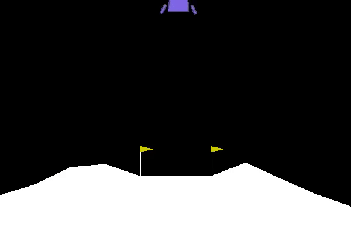

# RL_DQN_Autonomous_Lunar_Lander



Applying the DQN-Reinforcement Learning Algorithm to Gym's Lunar Lander environment.
The original paper explaining the Algorithm can be found here:
https://www.cs.toronto.edu/~vmnih/docs/dqn.pdf

### Prerequisites

What things you need to install the software and how to install them

OpenAIs Gym toolbox

```
pip install gym
```

PyTorch

```
pip install torchvision
```

### Running the experiements

Run the Notebook "Deep-Q-Network" to train your agent.
The notebook provides an comparison of the agents ability to land the lunar lander before and after training. You should see strong improvements.

### Optimizing tests

Tweak several Hyperparameters in the model (Hidden Layer size etc.) to see if you have performance gains.
Also you can play around with the exploration parameter epsilon and ReplayBuffer size in the dqn_agent.py


### Credits

Influenced by Udacities Nanoprogram: Deep Reinforcement Learning

https://eu.udacity.com/course/deep-reinforcement-learning-nanodegree--nd893

